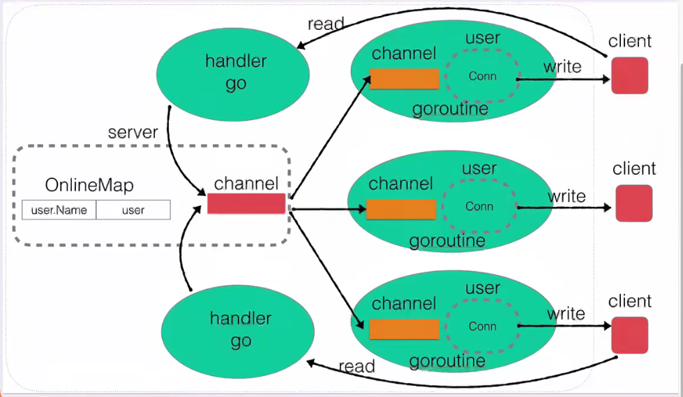

# golang即时通讯服务

## 简介

​		这是一个用于练习golang即使通讯app的服务端。handler_go 接收源client连接请求，将发送的消息放入主chanle中，再分发到目的用户的chanle ，从每个用户的chanle中取出消息发送到client

​		user信息存入Online.map 表中 userName :  user结构体

## 版本计划
### 架构基础server
### 用户上线
### 消息广播机制
### 用户业务封装
### 用户在线查询
### 修改用户名
### 超时强行t人